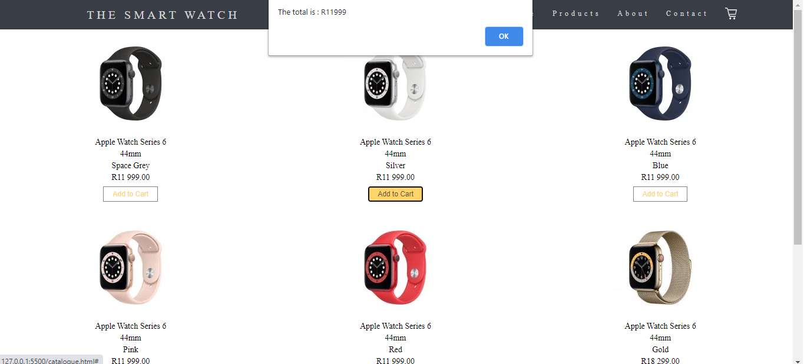
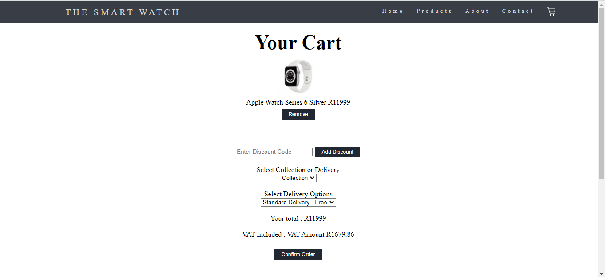

# Online-Store---Capstone-Project

Using HTML, CSS and JavaScript to create a fully functioning online store that uses the users local storage to store the details of the products. 
Some basic math also is used to perform functions like the cart total, discount codes, VAT and shipping fee. 

## Table of Contents
- [Description](#Online-Store---Capstone-Project)
- [Installation](#Installation)
- [Usage](#Usage)

## Installation
1. Download and unzip Task_Submission
2. Open index.html in vs code using live server

## Usage
1. Add items to the cart from the catalogue page

